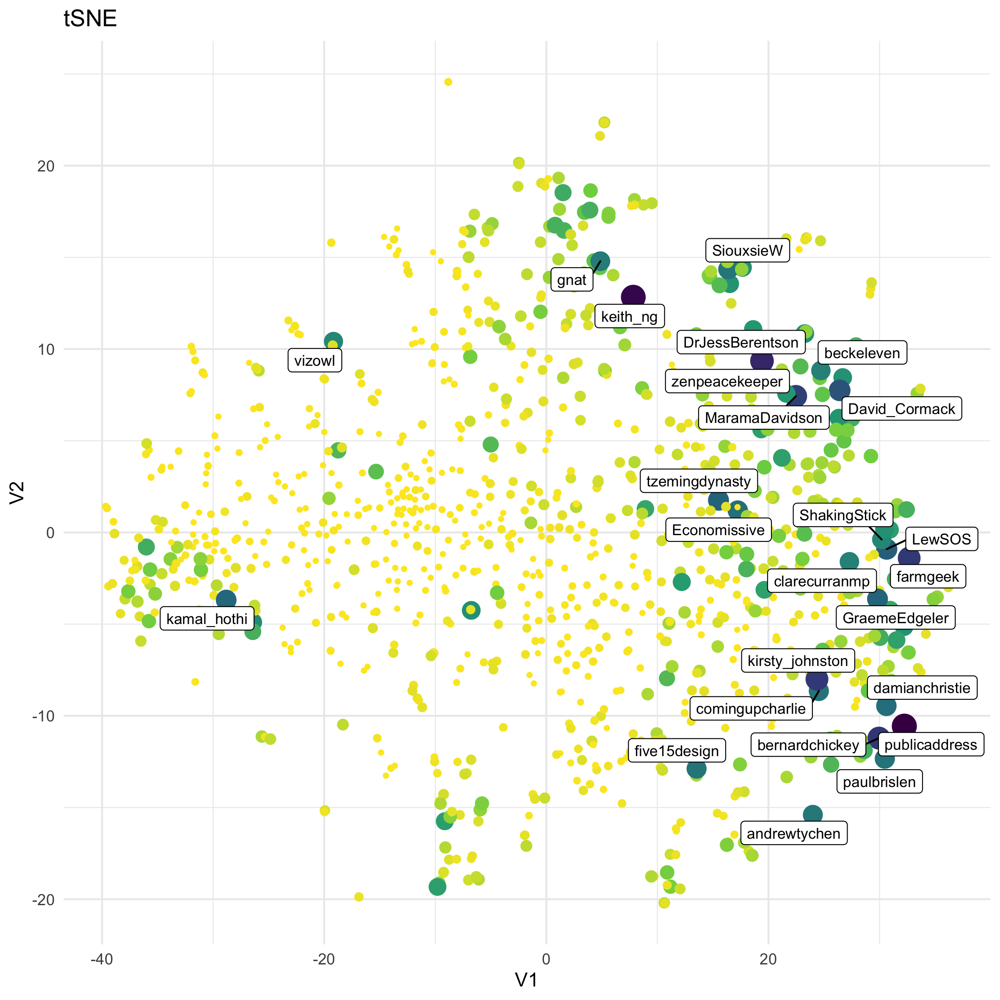

A map of my Twitter readers
================

## Day 29 of the \#30DayMapChallenge

Day 29 was the “Experimental” Map challenge, and as it is experimental I
wanted to provide a lot of narration for how my experiment proceeded.

I knew going in that I wanted to make a map of my Twitter reader’s
locations (relative to other reader’s locations).I have used dimension
reduction techniques to do things like this that seem to produce
sensible results, but not in this specific way.

First step is loading a bunch of helper libraries in R. Technically, I
loaded them when I thought it might be a good idea at the time, and have
since bundled them together at the start of this process as is customary
(and means that people can easily see what packages they would need to
do this).

``` r
library(rtweet) # for gather tweets
library(dplyr) # data handling
library(tidyr) # converting data from rows to columns
library(ggplot2) # making graphs
library(ggrepel) # adding labels that don't overlap
library(hexbin) # used for map background, needs to be present though no library command
library(Rtsne) # tSNE dimension reduction
library(umap) # umap dimension reduction
```

For using rtweet I am registered as a developer with Twitter and have
some app credentials stored on this machine (the details of which are
not part of this). I understand if you also use the httpuv package you
can do on-the-fly authorization with your standard twitter account
details, but I have never tested this.

``` r
tn <- get_followers("thoughtfulnz") # get my followers
usrs <- lookup_users(tn$user_id) # get the followers full details
sum(usrs$friends_count) # sum up their friends to get a sense of how big what I am doing is
```

I gathered up ids of those following me (you should use your own
username if you want your followers), and then their public details.
Then a sum up of the number of people they are friends with, and the
answer was around 1867000 publicly available friends relationships,
which is a reasonable sized job to
get.

``` r
# custom function that gets an accounts friends and saves them in a csv file in a "fren" folder
# this assumes there is a fren folder inside the current working directory (the folder
# which R is paying attention to)
allfriends <- function(target_account){
  friendable <- rate_limit("get_friends") #because mass downloading check rate limit
  if(friendable$remaining[1] < 1){
  # if the rate limit is exhausted, wait until it recovers
  Sys.sleep(as.numeric(difftime(friendable$reset_at[1], Sys.time(), units="secs")) +2)
  }
  #try and get the friends
  result <- tryCatch(get_friends(target_account, retryonratelimit = TRUE),
                   error = function(e) NULL, warning = function(w) NULL)
  # if friends were got save them as a csv
  if(!is.null(result)){
  write_as_csv(result, file_name=paste0("fren/",target_account,"FR.csv"))
  } 
}

still_to_get <- usrs$user_id
# in my case (around 1000 followers) this takes around 24 hours w. the rate limit
# if network problems etc cause a drop out substitue the line below to only check
# those not already downloaded
# still_to_get <- usrs$user_id[!(usrs$user_id %in% gsub("FR.csv","",list.files(path = "fren", pattern="FR\\.csv"), fixed = TRUE))]
lapply(still_to_get, allfriends) # get all the friends of all the people
```

Twitter has a rate limit - a limited number of requests in a 15 minute
period, so the commands are written to pause when it runs out, until it
can make more requests. But because, with the size of my followers
friends lists, I can expect this to take around 24 hours I am saving as
I go to allow for restarting after problems causing breaks. To ignore
already downloaded ones I remove the hash from the start of the line
beginning `still_to_get <- usrs$user_id[!(...`.

There may well still be friends lists you can’t get- for example if you
are followed by a very private account, so we are working with the
publicly available information. And that’s OK.

Some while later…

… I read in all the saved files and compile them into one
list.

``` r
list_of_relationships <- lapply(list.files(path = "fren",pattern="csv$", full.names = TRUE),
                                read.csv, colClasses = "character")
df_relationships <- bind_rows(list_of_relationships)
```

However, in a small tweak, I feel it is reasonable to add people as
friends of themselves, as I think people are interested in what they
themselves write as much as what any other person
does.

``` r
addenders <- data.frame(user =unique(df_relationships$user), stringsAsFactors = FALSE)
addenders$user_id <- paste0("x", addenders$user)
df_relationships <- bind_rows(df_relationships, addenders)
```

In my case this is (at time of analysis) 1541489 relationship pairs for
1048 accounts with public information.

Because my interest is in finding commonalities in who follows which
accounts, I figure I should check how large the problem would be if I
remove the accounts only followed by 1 person (as unique accounts, by
definition, are not shared with other people).

``` r
df_relationships %>% group_by(user_id) %>%
  mutate(occurances = n()) %>% ungroup() %>% filter(occurances > 1) %>% 
  count(user) %>% summarise(entries = sum(n), uniques= n())
```

That cuts the problem down to 1101753 pairs (for the 1048 accounts)
without losing anything I care about for this analysis, so I will do
that.

I am also turning it from a long list of individual pairs, to a (very)
wide list of one row for each person that follows me and a column for
each account followed by any (2 or more) of my followers.

``` r
wide_relationships <- df_relationships %>% group_by(user_id) %>%
  mutate(occurances = n()) %>% ungroup() %>% filter(occurances > 1) %>% 
  select(-occurances) %>% mutate(weight=1) %>%
  spread(user_id, weight, fill=0)
```

With 1048 rows and 162127 columns, where there is a 1 if a person
follows the account and a 0 if they do not, I want to use dimension
reduction techniques to reduce it down to 2 columns for an x and y
position to plot. I have used the tSNE technique on (much smaller)
similar projects in the past, and have heard interesting things about
UMAP as another technique so want to give them both a go.

But first, prevention is better than cure- I make sure the details of
the long form are saved (as that was the last step I had all the data),
and the original followers list (just in case it matters), in the event
anything catastrophic happens. I also turn the numeric part of the wide
data into a matrix, on the off-chance that lessens the processing load
on the computer. This thought may be folklore, but as I am looking at
reducing 162127 columns to 2 I figure it won’t hurt in the experiment.

``` r
write_as_csv(tn, file_name = "DH_followers.csv")
write.csv(df_relationships, file = "friends_of_followers.csv", row.names=FALSE)  
rm(list_of_files, list_of_relationships) # clearing some unneeded objects from memory

data_matrix <- as.matrix(wide_relationships[,2:ncol(wide_relationships)])
```

I did not save them into the fren folder so that it will only contain
the individual account friend relationships, to avoid later confusion
between csv files.

For making the tSNE reduction, I need to specify I used an iMac with 16
GB of RAM and a 4 GHz i7 processor. It took several minutes, towards the
end of which the cooling fans audibly got active. So a computer with
those specs had to work at
this.

``` r
tsne <- Rtsne(data_matrix, dims = 2, perplexity=40, verbose=FALSE, theta=0.0, max_iter = 500, check_duplicates=FALSE)
tsne2D <- as.data.frame(tsne$Y)
tsne2D$user = wide_relationships$user
# saving the bit I was interested in:
write.csv(tsne2D, file="tsne2D.csv", row.names=FALSE)
```

The UMAP version seemed to take a bit longer (I didn’t actually time
it), but did not seem to be as audibly hard on the computer in the
process.

``` r
friends.umap = umap(data_matrix)
umap2D <- as.data.frame(friends.umap$layout)
umap2D$user = wide_relationships$user
write.csv(umap2D, file="umap2D.csv", row.names=FALSE)
```

One thing I am personally interested in doing this for is exploring the
amount of cross-following- accounts that follow both me and accounts
that follow me, as this has implications around the spread of
information through my social network. I decide that if I am going to
treat strongly cross-followed accounts as major cites on a map, I need
to rank the accounts I analysed by how cross-followed they are among
those accounts that follow me.

``` r
prominance <- df_relationships %>% count(user_id) %>%
  mutate(user_id = gsub("x","", user_id)) 

landmarks <- usrs %>% left_join(prominance, by="user_id") %>%
  select(user =user_id, screen_name, follows = n) %>% 
  mutate(follows = ifelse(is.na(follows),0,follows)) 
# and saving it out to make it easy to come back to
write.csv(landmarks, file="landmarks.csv", row.names=FALSE)
```

From here it is a visualization exercise, as a map based off either the
tSNE or the UMAP with features supplied by the landmarks. So for
starting fresh from here, the code
is

``` r
umap <- read.csv("umap2D.csv", colClasses = c("numeric", "numeric", "character"))
tsne <- read.csv("tsne2D.csv", colClasses = c("numeric", "numeric", "character"))
landmarks <- read.csv("landmarks.csv", colClasses = c("character", "character",  "numeric"))
```

I create a map of points, scaled by the cross-following and labeling the
major ones to see how each map might look.

``` r
pltt <- tsne %>% inner_join(landmarks, by="user") %>% 
  mutate(screen_name=ifelse(follows > 240, 
                            screen_name, NA)) %>%
  
  ggplot(aes(x=V1,y=V2,size=follows, colour=follows)) + geom_point() +
  theme_minimal() + theme(legend.position = "none") + ggtitle("tSNE") +
  geom_label_repel(aes(label=screen_name), size=3, colour="black") + scale_colour_viridis_c(direction = -1)
ggsave(plot=pltt, filename = "tsne.png", width=18, height=18, units="cm")
```



``` r
pltu <- umap %>% inner_join(landmarks, by="user") %>% 
  mutate(screen_name=ifelse(follows > 240, 
                            screen_name, NA)) %>%
  
  ggplot(aes(x=V1,y=V2,size=follows, colour=follows)) + geom_point() +
  theme_minimal() + theme(legend.position = "none") + ggtitle("UMAP") +
  geom_label_repel(aes(label=screen_name), size=3, colour="black") + scale_colour_viridis_c(direction = -1)
ggsave(plot=pltu, filename = "umap.png", width=18, height=18, units="cm")
```


Of the two, the tSNE based image seems to be grouping what I consider
people of related interests (and so account types) better. I decide to
check by checking the position of a bunch of NZ and international
\#rstats accounts, to see how natural the groups seem to
be.

``` r
rstats = c("ellis2013nz", "robjhyndman", "kearneymw", "aschiff", "Kim_Fitter", "vizowl", "zentree", "minebocek", "jtleek", "revodavid", "jmarshallnz", "allison_horst", "kamal_hothi", "CMastication", "EmmaVitz", "tslumley")
pltt <- tsne %>% inner_join(landmarks, by="user") %>% 
  mutate(screen_name=ifelse(screen_name %in% rstats, 
                            screen_name, NA)) %>%
  ggplot(aes(x=V1,y=V2,size=follows, colour=follows)) + geom_point() +
  theme_minimal() + theme(legend.position = "none") + ggtitle("tSNE") +
  geom_label_repel(aes(label=screen_name), size=3, colour="black") + scale_colour_viridis_c(direction = -1)
ggsave(plot=pltt, filename = "tsner.png", width=18, height=18, units="cm")
```


``` r
pltu <- umap %>% inner_join(landmarks, by="user") %>% 
  mutate(screen_name=ifelse(screen_name %in% rstats, 
                            screen_name, NA)) %>%
  ggplot(aes(x=V1,y=V2,size=follows, colour=follows)) + geom_point() +
  theme_minimal() + theme(legend.position = "none") + ggtitle("UMAP") +
  geom_label_repel(aes(label=screen_name), size=3, colour="black") + scale_colour_viridis_c(direction = -1)
ggsave(plot=pltu, filename = "umapr.png", width=18, height=18, units="cm")
```


My interpretation is the that UMAP is producing a central core of New
Zealand culture with other interests radiating out from that, while the
tSNE is producing a series of key zones maximally dispersed with
individuals placed in relation to them. For a map, I prefer the tSNE as
it means I will be able to name regions. (I will acknowledge it is
possible to tweak the UMAP parameters to get different outputs, but the
overall goal is a map and the tSNE is doing OK for that out of the box).

As an aside, most(all?) of the strongly cross-followed accounts in the
first instance are individuals (not organisations or corporate) with an
interest in New Zealand Society and Culture, which I think reflects
something about the way New Zealand has a strong tendency to use Twitter
as a series of cafe style conversations between individuals.

Back to the map. I now test how effective the idea of using density
hexbins to represent land is going to be.

``` r
pltlnd <- tsne %>% inner_join(landmarks, by="user") %>% 
  mutate(screen_name=ifelse(follows > 80,screen_name, NA),
         xpoint = ifelse(follows > 80,V1, NA),
         ypoint = ifelse(follows > 80,V2, NA),
  ) %>%
  ggplot(aes(x=V1,y=V2)) + geom_hex(colour=NA) +
  scale_fill_gradient(low = "lightgoldenrod2", high = "forestgreen", 
                      na.value="lightblue1")
ggsave(plot=pltlnd, filename = "landmass.png", width=18, height=18, units="cm")
```


With a blue background, I can see that working OK as the map landscape.

To figure out what the regions should be called I massively overlabel
the map, so I can see who (among the more crosslinked people and so
those I am likely to be more familiar with) is where. And from who,
making some conclusions about what is similar about those accounts.

``` r
pltdetail <- tsne %>% inner_join(landmarks, by="user") %>% 
  mutate(screen_name=ifelse(follows > 50,screen_name, NA),
         xpoint = ifelse(follows > 50,V1, NA),
         ypoint = ifelse(follows > 50,V2, NA),
  ) %>%
  ggplot(aes(x=V1,y=V2)) + geom_hex(colour=NA) +
  scale_fill_gradient(low = "lightgoldenrod2", high = "forestgreen", 
                      na.value="lightblue1") + theme_void() +
  geom_point(aes(x=xpoint, y=ypoint)) +geom_label_repel(aes(label=screen_name)) +
  theme(legend.position = "none",
        panel.background = element_rect(fill = "lightblue1",
                                        colour = "lightblue1",
                                        size = 0.5, linetype = "solid"))
ggsave(plot=pltdetail, filename = "overlabelled.png", width=18, height=18, units="cm")
```


From the (over) abundance of labels, I can describe it as \#rstats in
the west, New Zealand culture in the east, New Zealand ecology in the
south, and New Zealand public information in the north. There are also a
few little offshore islands I can make narratives around.

For adding some annotations, I am getting the positioning from the early
versions that showed the x and y ranges. I did spend a few goes
experimenting with x and y coordinates and size that are not shown here.

``` r
pltregional <- tsne %>% inner_join(landmarks, by="user") %>% 
  ggplot(aes(x=V1,y=V2)) + geom_hex(colour=NA) +
  scale_fill_gradient(low = "lightgoldenrod2", high = "forestgreen", 
                      na.value="lightblue1") + theme_void() +
  theme(legend.position = "none",
        panel.background = element_rect(fill = "lightblue1",
                                        colour = "lightblue1",
                                        size = 0.5, linetype = "solid")) +
  annotate("text", x=-48, y=0, label="rstatenland", size=9, colour="#00000022", angle=90, family="serif") +
  annotate("text", x=0, y=28, label="Fiords of Public Info", size=9, colour="#00000022", family="serif")  +
  annotate("text", x=43, y=0, label="NZ Culture Coast", size=9, colour="#00000022", angle=90, family="serif") +
  annotate("text", x=-10, y=-22.5, label="Ecology Island", size=9, colour="#00000022", family="serif") +
  annotate("text", x=33, y=-16, label="AIland", size=6, colour="#00000022", family="serif") 
ggsave(plot=pltregional, filename = "regional.png", width=18, height=18, units="cm")
```


Adding the annotations also extended the range of the graph area, so the
area used in the density calculations (the land) has changed a little.

Now I will selectively add in accounts that I think are illustrative (so
a personal
choice)

``` r
cities <- c("publicaddress", "keith_ng", "DrJessBerentson", "bernardchickey", "kirsty_johnston", "farmgeek", "MaramaDavidson", "LewSOS", "tzemingdynasty", "GraemeEdgeler", "kamal_hothi", "zenpeacekeeper", "paulbrislen", "SiouxsieW", "andrewtychen", "clarecurranmp", "beckeleven", "vizowl", "tslumley", "marcuslush", "lyndonhood", "EricCrampton", "adzebill", "kimi_collins", "teh_aimee", "polemic", "JennyKayNZ", "EmmaVitz", "opendatanz", "GovStatistician", "Caleb_Speak", "Kim_Fitter", "KorimakoEcology", "dflydsci", "minebocek")
pltcities <- tsne %>% inner_join(landmarks, by="user") %>% 
  mutate(screen_name=ifelse(screen_name %in% cities,screen_name, NA),
         cityx = ifelse(screen_name %in% cities,V1, NA)) %>%
  ggplot(aes(x=V1,y=V2)) + geom_hex(colour=NA) +
  scale_fill_gradient(low = "lightgoldenrod2", high = "forestgreen", 
                      na.value="lightblue1") + theme_void() +
  geom_point(aes(x=cityx,y=V2, size=follows)) +
  scale_size_area(max_size=2) + ggtitle("Where my tweets travel") +
  geom_label_repel(aes(label=screen_name), size=1) +
  theme(legend.position = "none",
        panel.background = element_rect(fill = "lightblue1",
                                        colour = "lightblue1",
                                        size = 0.5, linetype = "solid")) +
  annotate("text", x=-48, y=0, label="rstatenland", size=9, colour="#00000022", angle=90, family="serif") +
  annotate("text", x=0, y=28, label="Fiords of Public Info", size=9, colour="#00000022", family="serif")  +
  annotate("text", x=43, y=0, label="NZ Culture Coast", size=9, colour="#00000022", angle=90, family="serif") +
  annotate("text", x=-10, y=-22.5, label="Ecology Island", size=9, colour="#00000022", family="serif") +
  annotate("text", x=27.5, y=-19, label="AIland", size=6, colour="#00000022", family="serif") 
ggsave(plot=pltcities, filename = "final.png", width=18, height=18, units="cm")
```


